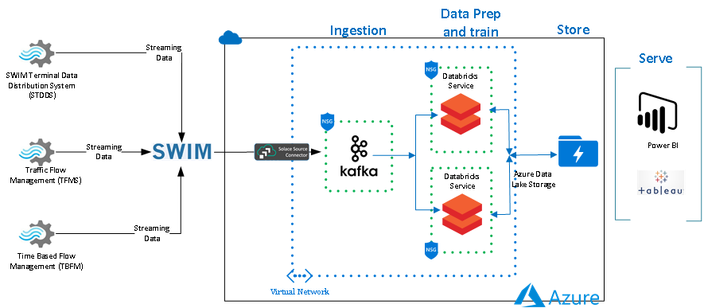
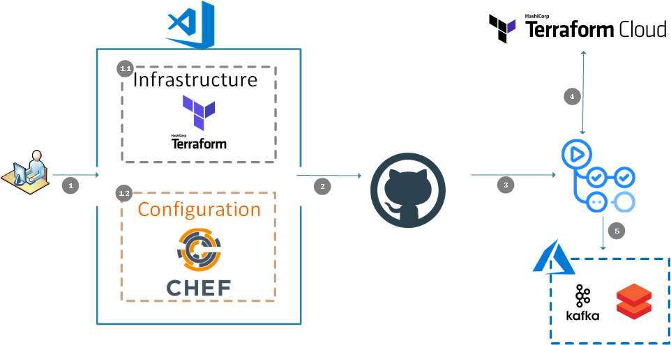
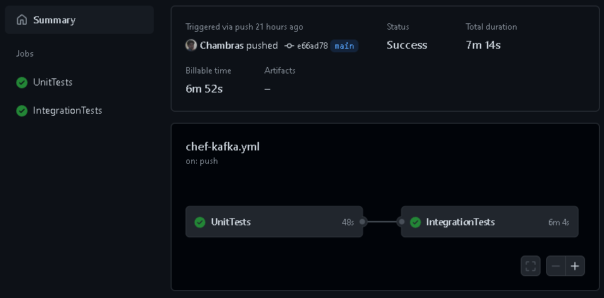
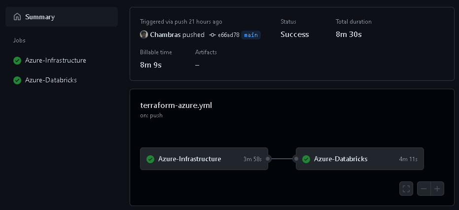

# Automating Data Analytics Environments

Demo project presented at [Automate for Good 2021](https://chef-hackathon.devpost.com/).
It shows how to integrate Chef Infra, Chef InSpec, Test Kitchen, Terraform, Terraform Cloud, and GitHub Actions in order to fully automate and create Data Analytics environments.

This specific demo uses FAA's System Wide Information System (SWIM) and connects to Traffic Flow Management System (TFMS), Time-Based Flow Management (TBFM) and SWIM Terminal Data Distribution System (STDDS) using a Kafka server.
More information about SWIM and its data sources can be found [here.](https://www.faa.gov/air_traffic/technology/swim/)

It also uses a Databricks cluster in order to analyze the data.

## Project Structure

This project has the following folders which make them easy to reuse, add or remove.

```ssh
.
├── .github
│   └── workflows
├── Chef
│   ├── .chef
│   ├── cookbooks
│   └── data_bags
├── Diagrams
├── Infrastructure
│   ├── terraform-azure
│   └── terraform-databricks
└── Notebooks
```

## SWIM Architecture


## Architecture

This is the architecture of the project. Which is basically a publish and subscribe architecture.



## CI/CD pipeline Architecture

It uses GitHub Actions in order to orchestrate the CI/CD pipeline.



### Dataflow

1. Developers work on either the Infrastructure or the Configuration code.

   1.1 Infrastructure code uses Terraform.

   1.2 Configuration code uses Chef.

2. Developers push their code to the GitHub repository using a GitHub pull request.

3. The pull request triggers a GitHub Actions workflow. The workflow runs the code through a series of tests. If the changes are configuration-related, the workflow runs Chef InSpec and Test Kitchen to test the code. Once the tests are completed, it reports the results back to GitHub. If the changes are infrastructure-related, the workflow also creates a Terraform plan and posts it as a comment in the pull request. The plan shows the changes that would be applied to the infrastructure if the pull request is approved.

4. If the changes are infrastructure-related, the workflow runs Terraform Cloud's remote state. Terraform Cloud is a hosted service that provides remote state management, locking, and other features.

5. If the tests pass, and the pull request is approved, the workflow merges the code into the `main` branch. Once merged the Actions workflow pushes changes in either the infrastructure or in the configurations for Kafka, Azure Databricks, and so on.

## Pre-requisites

This project requires the following versions:

- **Terraform** =>1.5.7
- **Azure provider** 3.74.0
- **Databricks provider** 1.26.0
- **Azure CLI** 2.52.0
- **ChefDK** 4.13.3

It also uses GitHub Secrets to store all required keys and secrets. The following GitHub Secrets need to be created ahead of time:

- **ARM_SUBSCRIPTION_ID** - Your Azure Subscription ID.
- **ARM_CLIENT_ID** - Your Azure Client ID.
- **ARM_CLIENT_SECRET** - Your Azure Client Secret.
- **ARM_TENANT_ID** - Your Azure Tenant ID.
- **PBLC_VM_SSH** - Public SSH key of the VM.
- **PRVT_VM_SSH** - Private SSH key of the VM.
- **CHF_VLDTR** - Chef Validator key.
- **TF_API_TOKEN** - Terraform Cloud API Token.

## GitHub Workflows

There are 2 GitHub Actions Workflows that are used in this project:

1. To automate the Infrastructure which will host the Data Analytics environment using Terraform.
2. The post-provisioning configurations required to connect to FAA's System Wide Information System (SWIM) and connects to Traffic Flow Management System (TFMS), Time-Based Flow Management (TBFM) and SWIM Terminal Data Distribution System (STDDS) data sources using **Chef Infra**.

- **Chef-ApacheKafka** - Performs Static code analysis using **Cookstyle**, unit testing using **Chef InSpec**, and Integration tests using **Test Kitchen** to make sure the cookbook is properly tested before uploading it to the Chef Server.



- **Terraform-Azure** - Performs Terraform deployment using Terraform Cloud as remote state. It also creates a Databricks cluster and deploys a starter python notebook to test the connectivity to the Kafka server and retrieves the messages for each data source (TFMS, TBFM and STDDS). All the infrastructure is created with proper naming convention and tagging.



## Caution

Be aware that by running this project your account will get billed.

## Authors

- Marcelo Zambrana
