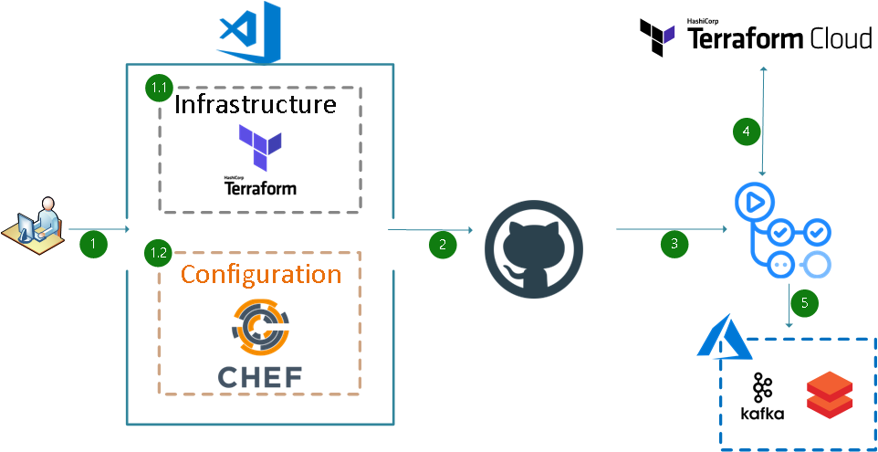

# Automating Data Analytics Environments

Demo project presented at [Automate for Good 2021](https://chef-hackathon.devpost.com/).
It shows how to integrate Chef Infra, Chef InSpec, Test Kitchen, Terraform, Terraform Cloud, and GitHub Actions in order to fully automate and create Data Analytics environments.

This specific demo uses FAA's System Wide Information System (SWIM) and connects to TFMS ( Traffic Flow Management System ) using a Kafka server.
More information about SWIM and TFMS can be found [here.](https://www.faa.gov/air_traffic/technology/swim/)

It also uses a Databricks cluster in order to analyze the data.

## Project Structure

This project has the following folders which make them easy to reuse, add or remove.

```ssh
.
├── .devcontainer
├── .github
│   └── workflows
├── LICENSE
├── README.md
├── Chef
│   ├── .chef
│   ├── cookbooks
│   └── data_bags
├── Infrastructure
│   ├── terraform-azure
│   └── terraform-databricks
└── Notebooks
```

## SWIM Architecture


## Architecture

This is the architecture of the project. Which is basically a publish and subscribe architecture.


## CI/CD pipeline Architecture

It uses GitHub Actions in order to orchestrate the CI/CD pipeline.



## Pre-requisites

This project requires the following versions:

- **Terraform** =>1.0.8
- **Azure provider** 2.80.0
- **Databricks provider** 0.3.5
- **Azure CLI** 2.29.0
- **ChefDK** 4.13.3

It also uses GitHub Secrets to store all required keys and secrets. The following GitHub Secrets need to be created ahead of time:

- **ARM_SUBSCRIPTION_ID** - Your Azure Subscription ID.
- **ARM_CLIENT_ID** - Your Azure Client ID.
- **ARM_CLIENT_SECRET** - Your Azure Client Secret.
- **ARM_TENANT_ID** - Your Azure Tenant ID.
- **PBLC_VM_SSH** - Public SSH key of the VM.
- **PRVT_VM_SSH** - Private SSH key of the VM.
- **CHF_VLDTR** - Chef Validator key.
- **TF_API_TOKEN** - Terraform Cloud API Token.

## GitHub Workflows

There are 2 GitHub Actions Workflows that are used to automate the Infrastructure which will host the Data Analytics environment using Terraform and the post-provisioning configurations required to connect to FAA's System Wide Information System (SWIM) and connects to TFMS ( Traffic Flow Management System ) datasource using **Chef Infra**.

- **Chef-ApacheKafka** - Performs Static code analysis using **Cookstyle**, unit testing using **Chef InSpec**, and Integration tests using **Test Kitchen** to make sure the cookbook is properly tested before uploading it to the Chef Server.


- **Terraform-Azure** - Performs Terraform deployment using Terraform Cloud as remote state. It also creates a Databricks cluster and deploys a starter python notebook to test the connectivity to the Kafka server and retrieves the messages. All the infrastructure is created with proper naming convention and tagging.


## devcontainer

This repository also comes with a devcontainer which can be used to develop and test the project using Docker containers or GitHub Codespaces.

## Caution

Be aware that by running this project your account will get billed.

## Authors

- Marcelo Zambrana
